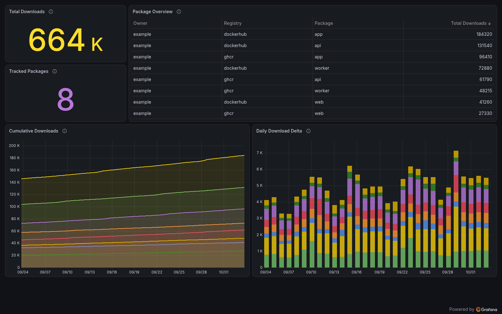

# registry-stats

[](https://github.com/cplieger/registry-stats/pkgs/container/registry-stats) [](https://github.com/cplieger/registry-stats/pkgs/container/registry-stats) [](https://github.com/cplieger/registry-stats/blob/main/Dockerfile) [](https://github.com/cplieger/registry-stats/issues?q=label%3Agremlins-tracker) [](https://github.com/cplieger/registry-stats/releases)

<!-- hub-overview BEGIN -->
registry-stats graphs the pull counts that Docker Hub and GitHub Container Registry report for your public images, on a ready-made Grafana dashboard. Your Prometheus server scrapes the current counts and keeps the history, so the graphs begin on the day you start registry-stats.



## What it does

registry-stats helps you follow the pull counts of your published images over time:

- Graphs each image's reported total and its daily change on the bundled dashboard.
- Tracks Docker Hub and GitHub Container Registry (GHCR) images side by side.
- Picks up an owner's public images with `owner/*` on every check, new ones included, up to 198 Docker Hub repositories or 50 GHCR listing pages per owner.
- Ships alert rules for a stopped collector, a failing registry and a pull count that drops.

## Who it is for

registry-stats is built for people who publish public container images. It checks the registries every hour by default, needs no registry login and keeps no pull history itself.

You need a Prometheus-compatible server such as Prometheus or Mimir to scrape it, and a Grafana instance for the dashboard. It reads public images only. Keep its port on your own network, because the metrics endpoint has no login.

One other project suits a different need. Consider [ghcr-badge](https://github.com/eliasbenb/ghcr-badge) if you only want a README badge with a GHCR package's download count. It is an API service that returns the count as JSON and as a shields.io badge.

registry-stats is free software under the GPL-3.0-or-later license.
<!-- hub-overview END -->

## Quick start

The image is on GitHub Container Registry and Docker Hub, for `amd64` and `arm64`. This is the [`compose.yaml`](compose.yaml) in this repository. Each release is also tagged with its full version, `v<major>.<minor>` and `v<major>`, so you can pin one.

```yaml
services:
  registry-stats:
    image: ghcr.io/cplieger/registry-stats:latest
    container_name: registry-stats
    restart: unless-stopped

    environment:
      # Set at least one of the two lists before the first start, or the container turns unhealthy after its first check.
      DOCKERHUB_REPOS: ""  # owner/repo or owner/*, comma-separated
      GHCR_REPOS: ""  # owner/package or owner/*, comma-separated
      POLL_INTERVAL_HOURS: "1"  # 0 = check once, then keep serving the counts

    ports:
      # The metrics endpoint has no login, so this example publishes it to this host only.
      # For a collector on another host, publish it on a trusted address such as "192.0.2.10:9100:9100", never "9100:9100".
      - "127.0.0.1:9100:9100"
```

1. Save the file as `compose.yaml` in an empty folder.
2. Fill in `DOCKERHUB_REPOS`, `GHCR_REPOS` or both, for example `GHCR_REPOS: "myuser/*"` for every public package of `myuser`.
3. Run `docker compose up -d` in that folder.

Run `docker logs registry-stats`. You should see `collection complete` with an `images=` count above 0. If you see `no repos configured`, both lists are empty.

## Adding it to Prometheus and Grafana

1. Add a scrape job named `registry-stats` in Prometheus, Grafana Alloy or another Prometheus-compatible scraper. Its target is `registry-stats:9100` when the scraper shares a Docker network with the container, or the address you published the port on. The shipped alert rules assume `job="registry-stats"`.
2. In Grafana, open Dashboards, then New, then Import, and upload [`grafana-dashboard.json`](grafana-dashboard.json).
3. Select your Prometheus or Mimir data source when Grafana asks for one.

The dashboard needs no plugin. To pin it to the release you run, or to load it with grafana-operator, see [Monitoring and alerts](docs/monitoring.md#dashboard).

## Configuration reference

Settings are environment variables, read once at start, so recreate the container after a change. Every one is optional.

| Variable | Description | Default |
| --- | --- | --- |
| `DOCKERHUB_REPOS` | Docker Hub repos, comma-separated: `owner/repo`, or `owner/*` for every public repo of one owner, up to 198 | _(unset)_ |
| `GHCR_REPOS` | GHCR packages, comma-separated: `owner/package`, or `owner/*` for every public package of one owner, up to about 1,500 | _(unset)_ |
| `POLL_INTERVAL_HOURS` | Hours between checks. `0` checks once, then keeps serving the counts | `1` |
| `LOG_LEVEL` | `debug`, `info`, `warn` or `error`. Keep `info` for the shipped log alert rules | `info` |
| `LISTEN_ADDR` | Listen address in `host:port` form. The port must match the published container port | `:9100` |

| Port | Description |
| --- | --- |
| `9100` | Prometheus metrics on `/metrics` and the readiness check on `/api/health` |

registry-stats needs no volume. [Configuration](docs/configuration.md) covers wildcards, nested GHCR package names and the Docker Hub rate limit.

## Security

The metrics endpoint has no login. Keep port 9100 on your own network. The example publishes it on `127.0.0.1` only.

registry-stats holds no credential, because it reads public pages and the unauthenticated Docker Hub API. The image runs as the distroless `nonroot` user with no shell. Its client follows redirects only to `docker.com`, `github.com` and `githubusercontent.com` hosts. [Security](docs/hardening.md) has the hardened compose settings and what the image contains.

## Troubleshooting

The healthcheck runs `/registry-stats health`, which reads a marker file in `/tmp`. The container is healthy while its last check collected at least one image. It turns unhealthy when a whole check collects nothing. It also turns unhealthy when it sends no registry request for one poll interval plus three minutes, which means the collector is stuck. `restart: unless-stopped` does not restart an unhealthy container, so act on the status from your monitoring.

The next successful check makes it healthy again. With `POLL_INTERVAL_HOURS=0`, a failed check stays unhealthy until you restart the container.

- `skipping unusable repo ref` in the log means an entry is not `owner/repo` or `owner/*`. The line names the entry and the reason.
- `ghcr HTML format may be changing` means GitHub changed its package pages, which registry-stats reads because GitHub has no API for download counts. Please [open an issue](https://github.com/cplieger/registry-stats/issues).
- An image can be missing from one check when an owner listing stops partway or a rate limit hits. It returns on the next check that reads it.

[How registry-stats works](docs/how-it-works.md) explains each case.

## Monitoring

registry-stats serves Prometheus metrics on `/metrics` and writes logfmt logs in UTC. Five PromQL alert rules ship in [`alerts/promql.yaml`](alerts/promql.yaml) and three Loki rules in [`alerts/logql.yaml`](alerts/logql.yaml). [Monitoring and alerts](docs/monitoring.md) lists the metrics, the dashboard and the rules, and shows how to load them.

## Documentation

- [Configuration](docs/configuration.md) explains every setting in depth.
- [How registry-stats works](docs/how-it-works.md) covers the checks, wildcards, health and limits.
- [Monitoring and alerts](docs/monitoring.md) lists the metrics, the dashboard and the alert rules.
- [Security](docs/hardening.md) covers hardening and what the image contains.

## Credits

registry-stats reads pull counts from the [Docker Hub API](https://docs.docker.com/docker-hub/api/latest/) and from the public package pages of GitHub Container Registry.

## Contributing

Issues and pull requests are welcome. For a larger change, please open an issue first. See [CONTRIBUTING.md](CONTRIBUTING.md).

## Disclaimer

This project is built with care and follows security best practices, but it is intended for personal / self-hosted use. No guarantees of fitness for production environments. Use at your own risk.

This project was built with AI-assisted tooling using [Claude](https://claude.com), [GPT](https://openai.com), and [Kiro](https://kiro.dev). The human maintainer defines architecture, supervises implementation, and makes all final decisions.

## License

GPL-3.0-or-later. See [LICENSE](LICENSE). The image carries the license text of every bundled component under `/usr/share/licenses/`.
